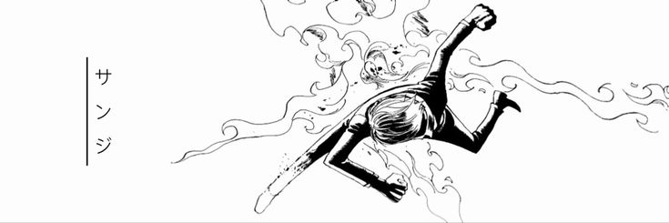

# Davi Werneck | Wer

 Backend Developer. Proficient in building performatic APIs and
translating ideias into functional applications. Eager to contribute and grow within a
dynamic team.

 

# 💻 My Tech Stack

<table align="center" width="100%">
  <tr>
    <td align="center" width="200" valign="top">
      <h3>📋 Programming Languages</h3>
    </td>
    <td valign="top">
      
      
      
      
      
      
      
      
      
      
    </td>
  </tr>
  <tr>
    <td align="center" width="200" valign="top">
      <h3>💾 Databases</h3>
    </td>
    <td valign="top">
      
      
      
      
      
    </td>
  </tr>
  <tr>
    <td align="center" width="200" valign="top">
      <h3>📚 Frameworks, Platforms & Libraries</h3>
    </td>
    <td valign="top">
      
      
      
      
      
      
      
      
    </td>
  </tr>
  <tr>
    <td align="center" width="200" valign="top">
      <h3>🕓 Version Control</h3>
    </td>
    <td valign="top">
      
      
      
    </td>
  </tr>
  <tr>
    <td align="center" width="200" valign="top">
      <h3>🔬 CI</h3>
    </td>
    <td valign="top">
      
      
    </td>
  </tr>
  <tr>
    <td align="center" width="200" valign="top">
      <h3>🔨 Tools & Editors</h3>
    </td>
    <td valign="top">
      
      
    </td>
  </tr>
  <tr>
    <td align="center" width="200" valign="top">
      <h3>🥅 Others</h3>
    </td>
    <td valign="top">
      
      
      
      
    </td>
  </tr>
  <tr>
    <td align="center" width="200" valign="top">
      <h3>🌐 Browsers</h3>
    </td>
    <td valign="top">
      
      
      
    </td>
  </tr>
</table>

---

  <h1>🐍 My Contributions 🐍</h1>
   
  

---

# 📩 Contact Me

  <!-- Gmail -->
  
  <!-- LinkedIn -->
  
  <!-- Portfolio -->
  
  <!-- Github -->
  
  <!-- Discord -->
  
  
  <!-- Instagram -->
  

 

